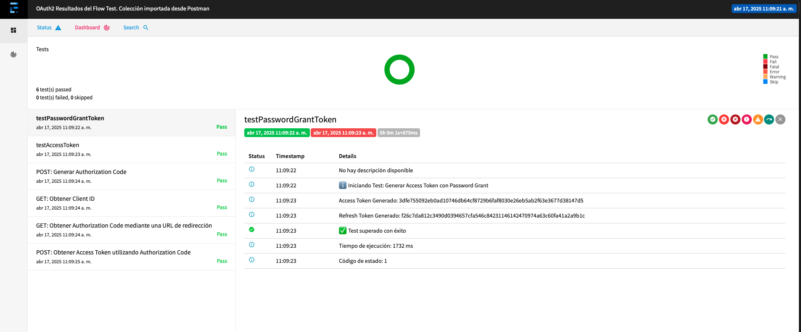

# SignNow API Tests 🚀


Tests API automatizados para validar los flujos de autenticación OAuth2 de SignNow utilizando `Rest Assured` y `TestNG`.

## Tabla de Contenidos 📚
- [Descripción](#descripción)
- [Tecnologías](#tecnologías)
- [Estructura del Proyecto](#estructura-del-proyecto)
- [Requisitos](#requisitos)
- [Configuración](#configuración)
- [Instalación](#instalación)
- [Ejecutar Pruebas](#ejecutar-pruebas)
- [Ver Reporte](#ver-reporte)
- [Flujos OAuth2 Probados](#flujos-oauth2-probados)
- [CI/CD](#cicd)
- [Contribuciones](#contribuciones)
- [Licencia](#licencia)

## Descripción 📝

Este proyecto implementa pruebas automatizadas para validar los diferentes flujos de autenticación OAuth2 de la API de SignNow:

- Password Grant Flow
- Authorization Code Flow
- Verificación de tokens
- Refresh de tokens

Las pruebas validan la correcta implementación del protocolo OAuth2 y la gestión de tokens por parte de la API de SignNow.

## Tecnologías 💻

- Java 17+
- Gradle
- TestNG como framework de testing
- Rest Assured para pruebas de API REST
- Extent Reports para generación de reportes
- Jsoup para parsing de HTML
- Dotenv para gestión de variables de entorno

## Estructura del Proyecto 🏗️

```
signnow-api-tests/ 
├── build.gradle
├── gradle.properties
├── gradlew
├── gradlew.bat
├── src/
│   ├── test/
│   │   ├── java/
│   │   │   ├── com/
│   │   │   │   ├── signnow/
│   │   │   │   │   ├── base/ # Clases base para pruebas
│   │   │   │   │   ├── config/ # Configuración y variables de entorno
│   │   │   │   │   ├── services/ # Servicios para pruebas
│   │   │   │   │   ├── tests/ # Pruebas
│   │   │   │   │   ├── utils/ # Utilidades
│   │   │   ├── resources/
├── .env # Variables de entorno (no incluido en git) 
├── .gitignore 
├── build.gradle 
├── Makefile # Comandos automatizados 
└── README.md


```

## Requisitos 📋

- Java 17 o superior
- Gradle 7+ (o usar Gradle Wrapper incluido)
- IntelliJ IDEA (recomendado)
- Cuenta de desarrollador en SignNow

## Configuración ⚙️

1. Crea un archivo `.env` en la raíz del proyecto con las siguientes variables:

```bash
CLIENT_ID=tu_client_id 
CLIENT_SECRET=tu_client_secret 
BASIC_AUTH_TOKEN=base64_de_client_id:client_secret 
USERNAME=tu_username 
PASSWORD=tu_password

```


> 💡 **Nota**: Para obtener el BASIC_AUTH_TOKEN, codifica en Base64 la cadena "CLIENT_ID:CLIENT_SECRET".

## Instalación 💻
 
```bash
# Clonar el repositorio
git clone [https://github.com/tu-usuario/signnow-api-tests.git](https://github.com/tu-usuario/signnow-api-tests.git) cd signnow-api-tests
# Instalar dependencias
make install

```
El comando `make install` ejecuta:
- Configuración de Gradle
- Descarga de dependencias
- Verificación de variables de entorno


## Ejecutar pruebas 🏃‍♂️

### Ejecutar todas las pruebas


```bash
make run-tests
```
### Ejecutar una prueba específica

```bash

bash make run-tests TEST=OAuth2UserAuthTest

```

### Ejecutar un método de prueba específico

```bash

make run-test-method TEST=OAuth2TokenWithAuthCodeTest METHOD=testAuthCodeViaRedirect

```


## Ver reporte 📊

```bash
make report
```
Este comando abrirá automáticamente el informe HTML generado en tu navegador predeterminado.



## Flujos OAuth2 Probados 🔐

### 1. Password Grant Flow

```java
// Ejemplo simplificado 
Response response = AuthService.getPasswordGrantToken( EnvConfig.getUsername(), EnvConfig.getPassword(), EnvConfig.getBasicAuthToken);
``` 


### 2. Authorization Code Flow

```java
// 1. Obtención del código de autorización 
Response response = AuthService.requestAuthorizationCode( clientId, accessToken, redirectUri );
// 2. Intercambio del código por tokens 
String authCode = AuthService.extractAuthCodeFromResponse(response, redirectUri); Response tokenResponse = AuthService.getTokenWithAuthCode(authCode, basicAuthToken);

```

## CI/CD 🔄

Este proyecto utiliza GitHub Actions para automatizar las pruebas en cada push y pull request. El flujo de trabajo incluye:

- Compilación y verificación del código
- Ejecución de todas las pruebas
- Generación y publicación de reportes

Puedes ver los workflows en el directorio `.github/workflows/`.

## Contribuciones 🤝

Las contribuciones son bienvenidas. Por favor, sigue estos pasos:

1. Haz fork del repositorio
2. Crea una rama (`git checkout -b feature/amazing-feature`)
3. Haz commit de tus cambios (`git commit -m 'Add amazing feature'`)
4. Push desde la rama (`git push origin feature/amazing-feature`)
5. Abre un Pull Request

Asegúrate de que todas las pruebas pasen y de seguir el estilo de código establecido.

## Licencia 📄

Este proyecto está bajo la Licencia MIT. Consulta el archivo [LICENSE](LICENSE) para más detalles.


